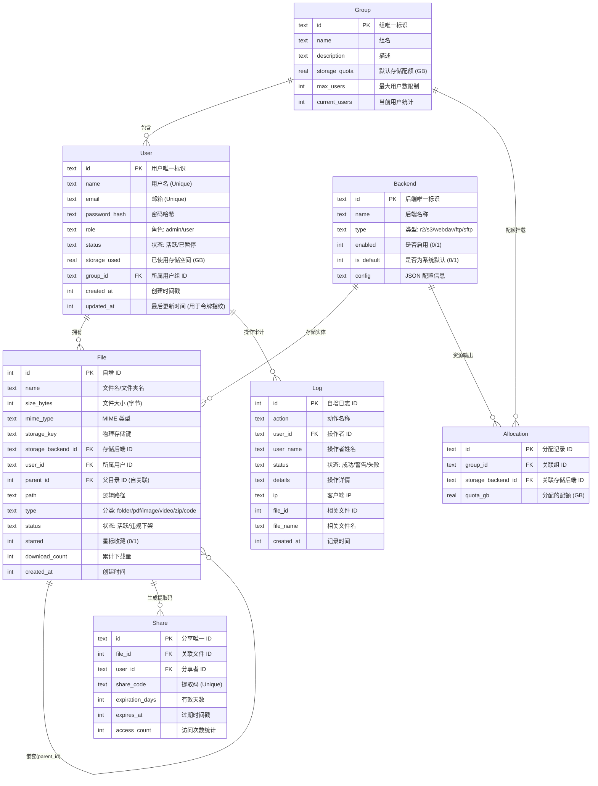

# SimpleShare 数据库实体关系图 (ER Diagram)

本项目采用基于 Mermaid 语法的 ER 图设计，精准描述了分布式对象存储系统中各实体间的逻辑关联。

## 设计要点说明：
1. **存算分离**：`File` 实体通过 `storage_backend_id` 灵活关联不同的物理后端（R2/S3等）。
2. **多维审计**：`Log` 记录详尽的操作上下文，支持对管理员与普通用户的行为追踪。
3. **合规设计**：`File` 实体的 `status` 字段配合管理员 Takedown 逻辑，实现对违规内容的元数据保留式删除。
4. **安全指纹**：`User` 实体的 `updated_at` 作为 HMAC 令牌的版本指纹，保障账号找回的安全性。

